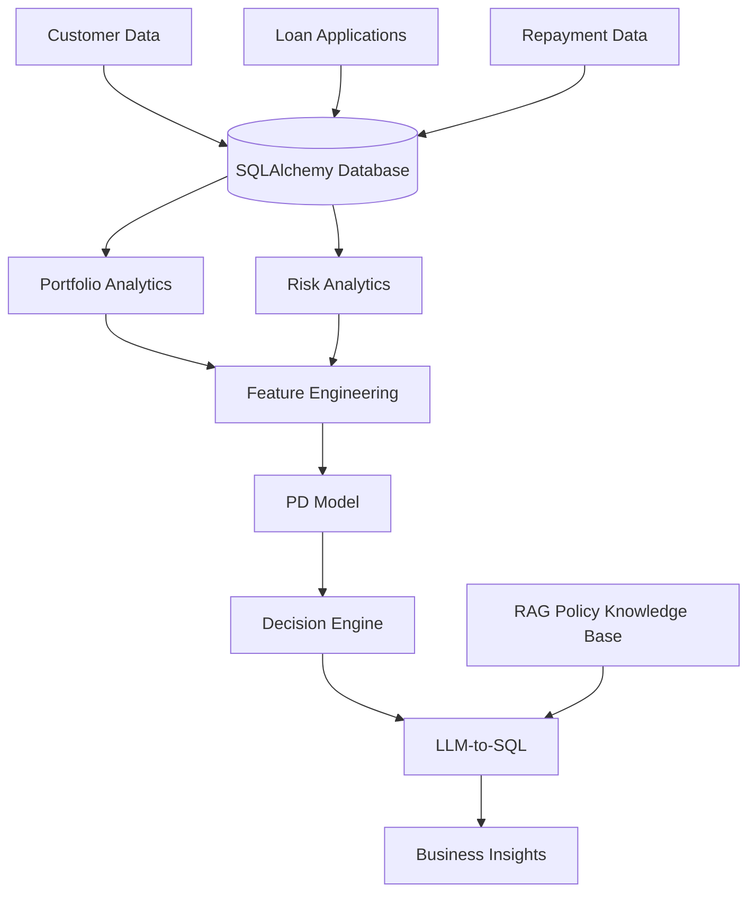

# AI FinTech Decision Intelligence System

An end-to-end FinTech Decision Intelligence platform that combines credit risk analytics, machine learning, decision intelligence, and Generative AI to support lending decisions and portfolio monitoring.

## Project Overview

This project simulates how modern fintech lenders evaluate loan applications, monitor portfolio risk, and generate business insights using analytics, machine learning, and Large Language Models (LLMs).

The system is being built with a modular architecture to separate data storage, analytics, machine learning, decisioning, and AI-powered business intelligence.

---

## Current Features

### Database Layer

- SQLAlchemy ORM implementation
- Relational lending database design
- Customer management
- Loan application management
- Loan tracking
- Repayment tracking

### Synthetic Data Generation

- Customer demographics
- Employment profiles
- Credit characteristics
- Loan applications
- Loan approvals/rejections
- Repayment behaviour
- Default scenarios

### Portfolio Analytics

Implemented portfolio KPIs:

- Total Customers
- Total Loan Applications
- Total Approved Loans
- Approval Rate
- Total Disbursed Amount
- Average Loan Size

---

## Architecture



---

## Folder Structure

```text
AI-FinTech-Decision-Intelligence-System/
│
├── analytics/
│   ├── portfolio_analysis.py
│   ├── risk_analysis.py
│   ├── customer_analysis.py
│   ├── profitability_analysis.py
│
├── app/
│   ├── api.py
│   └── main.py
│
├── core/
│   ├── decision.py
│   ├── financial_engine.py
│   └── explainability.py
│
├── db/
│   ├── database.py
│   ├── init_db.py
│   ├── models.py
│   ├── schema.py
│   └── seed.py
│
├── infrastructure/
│   └── config.py
│
├── llm/
│   └── agent.py
│
├── ml/
│   ├── features.py
│   ├── train.py
│   └── predict.py
│
├── scripts/
│   └── generate_data.py
│
├── tests/
│
├── data/
│   └── business.db
│
├── requirements.txt
├── README.md
└── .gitignore
```

---

## Technology Stack

### Data & Analytics

- Python
- Pandas
- NumPy
- SQLAlchemy
- SQLite

### Machine Learning

- Scikit-learn

### AI & LLM (Planned)

- LangChain
- OpenAI APIs
- RAG Architecture

### Backend (Planned)

- FastAPI

### Development Tools

- Git
- GitHub
- VS Code

---

## Development Roadmap

### Phase 1 — Data Foundation

- [x] Database Design
- [x] SQLAlchemy ORM
- [x] Synthetic Data Generation

### Phase 2 — Analytics

- [x] Portfolio Analytics
- [x] Risk Analytics
- [ ] Customer Analytics
- [ ] Profitability Analytics

### Phase 3 — Machine Learning

- [ ] Feature Engineering
- [ ] Probability of Default (PD) Model
- [ ] Risk Segmentation

### Phase 4 — Decision Intelligence

- [ ] Automated Lending Decisions
- [ ] Approval Threshold Logic
- [ ] Explainable Decisions

### Phase 5 — Generative AI

- [ ] LLM-to-SQL
- [ ] Business Insight Generation
- [ ] RAG Policy Intelligence

---

## Business Objective

The objective of this project is to demonstrate how analytics, machine learning, decision intelligence, and generative AI can be combined to support:

- Credit Risk Assessment
- Lending Decisions
- Portfolio Monitoring
- Business Intelligence
- Explainable AI in Financial Services

---

## Project Status

🚧 Active Development

Current Focus:
- Risk Analytics Module
- Feature Engineering for Probability of Default (PD) Modelling

---

## Author

**Balamurugan Purushothaman**

AI Engineer | FinTech Analytics Enthusiast
